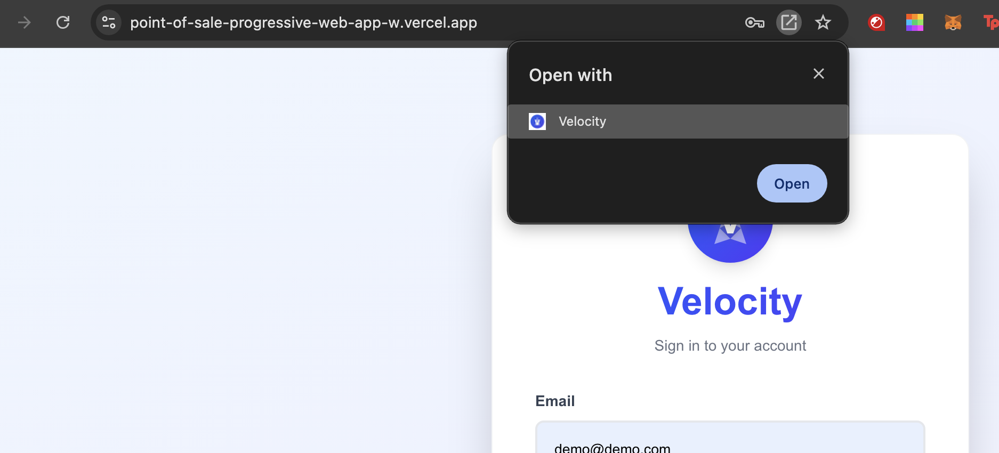
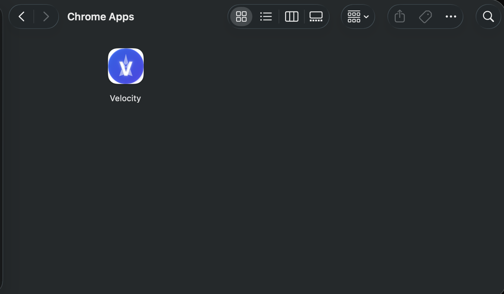

# Velocity - Point of Sale System

A modern, full-featured Point of Sale (POS) system built with Next.js, TypeScript, and Prisma. Velocity is a Progressive Web App (PWA) that can be installed on mobile devices and tablets, providing a complete solution for managing inventory, sales, suppliers, and customer loyalty programs.

## 🚀 Live Demo

**[Try the live demo on Vercel →](https://point-of-sale-progressive-web-app-w.vercel.app/)**

### 📱 Install as PWA

Velocity can be installed as a Progressive Web App on desktop and mobile devices:



**Installation Steps:**

#### MacBook (Chrome/Edge)
1. Visit the app in your browser
2. Look for the install icon in the address bar (or use the "Install App" button)
3. Click "Install" when prompted
4. A dialog will appear asking "Open with" - select "Velocity" and click "Open"
5. The app will be installed and accessible from your Applications folder



#### Android
1. Open the app in Chrome on your Android device
2. Tap the "Install App" button (appears after a few seconds)
3. Follow the browser's install prompt
4. The app will be added to your home screen

#### iOS
1. Open the app in Safari
2. Tap the Share button (square with arrow)
3. Scroll and tap "Add to Home Screen"
4. Tap "Add" to confirm

## 📱 Features

### Core Functionality
- **User Authentication**: Secure sign-in with email and password validation
- **Dashboard**: Central hub with navigation to all system modules
- **Inventory Management**: 
  - Add, edit, and delete products
  - Track quantities with automatic deduction on sales
  - Color-coded stock levels (low/medium/high thresholds)
  - Barcode support for products
  - Stock notifications for low/out-of-stock items

### Sales & Transactions
- **Point of Sale Screen**: 
  - Product selection via tap, search, or barcode scanning
  - Shopping cart management (add/remove items, adjust quantities)
  - Discount system (percentage or fixed amount)
  - Multiple payment methods:
    - Cash
    - Card (simulated payment processing)
    - PayPal
    - Gift Card (with barcode scanning)
    - Loyalty Points

### Supplier Management
- **Supplier CRUD**: Create, read, update, and delete supplier information
- **Purchase Orders**: 
  - Create purchase orders with multiple items
  - Set expected arrival dates
  - Generate PDF invoices
  - Email purchase orders to suppliers
- **Supplier Pricing**: Set supplier-specific prices for products

### Customer Loyalty
- **Automatic Customer Registration**: Customers are automatically registered on first purchase
- **Loyalty Points System**: 
  - Configurable points per dollar spent
  - Points can be used as payment method
  - Track customer spending history
  - Search customers by name or card number

### Analytics & Settings
- **Stock Threshold Management**: 
  - Customizable low/medium/high stock thresholds
  - AI-powered recommendations based on sales analytics (last week, month, year)
- **Loyalty Points Configuration**: Enable/disable and configure points per dollar
- **Sales Analytics**: Track sales history and generate recommendations

## 🛠️ Tech Stack

- **Framework**: Next.js 16 (App Router)
- **Language**: TypeScript
- **Styling**: Tailwind CSS 4
- **Database**: SQLite with Prisma ORM
- **PWA**: Service Worker + Web Manifest for installability
- **PDF Generation**: HTML to PDF conversion for purchase orders

## 📋 Prerequisites

- Node.js 20.9.0 or higher
- npm or yarn

## 🔧 Installation

1. **Clone the repository**
   ```bash
   git clone https://github.com/your-username/pos-app.git
   cd pos-app
   ```

2. **Install dependencies**
   ```bash
   npm install
   ```

3. **Set up the database**
   ```bash
   npx prisma generate
   npx prisma db push
   ```

4. **Run the development server**
   ```bash
   npm run dev
   ```

5. **Open your browser**
   Navigate to [http://localhost:3000](http://localhost:3000)

## 🔐 Demo Credentials

You can use the following credentials to log in and explore the application:

**Email**: `demo@demo.com`  
**Password**: `demo`

## 📖 How to Use

### Getting Started

1. **Sign In**
   - Navigate to the login page
   - Enter your email and password
   - Click "Sign In"

2. **Dashboard**
   - View stock notifications
   - Navigate to different modules:
     - **Inventory**: Manage your product catalog
     - **Point of Sale**: Process customer transactions
     - **Supplier Management**: Manage suppliers and purchase orders
     - **Settings**: Configure stock thresholds and loyalty points

### Managing Inventory

1. Go to **Inventory** from the dashboard
2. Click **"+ Add Product"** to add a new product
3. Fill in product details (name, price, quantity, optional barcode)
4. Click **"Save Product"**
5. Use the **Edit** button to update product information
6. Use the **Delete** button to remove products

### Processing Sales

1. Go to **Point of Sale** from the dashboard
2. Search for products or scan barcodes
3. Tap products to add them to the cart
4. Adjust quantities as needed
5. Apply discounts if applicable (percentage or fixed amount)
6. Click **"Checkout"** and select a payment method
7. Complete the transaction

### Managing Suppliers

1. Go to **Supplier Management** from the dashboard
2. Click **"+ Add Supplier"** to add a new supplier
3. Click **"Set Prices"** next to a supplier to configure product prices
4. Click **"Create Purchase Order"** to create a new order
5. Add items, set quantities, and expected arrival date
6. Click **"Generate PDF"** or **"Send Email"** to send the order to the supplier

### Configuring Settings

1. Go to **Settings** from the dashboard
2. Set custom stock thresholds or use recommended values
3. Enable/disable loyalty points
4. Configure points per dollar spent
5. Click **"Update Settings"** to save

## 🎨 Design

Velocity features a modern, clean UI with:
- Gradient backgrounds (blue to indigo to purple)
- Responsive design for mobile and tablet devices
- Custom logo with lightning bolt design
- Intuitive navigation and user-friendly forms
- Color-coded stock indicators

## 📱 Progressive Web App

Velocity is installable as a PWA on mobile devices and tablets:
- Add to home screen on iOS/Android
- Works offline (with service worker caching)
- Native app-like experience

## 🔒 Security Notes

⚠️ **Important**: This is a demo application. For production use:
- Implement proper authentication (JWT, OAuth, etc.)
- Integrate with secure payment gateways (Stripe, Square, PayPal)
- Add proper database security and encryption
- Implement role-based access control
- Add input validation and sanitization
- Use HTTPS in production


## 📝 License

This project is open source and available under the MIT License.

## 🤝 Contributing

Contributions, issues, and feature requests are welcome! Feel free to check the issues page.

## 👤 Author

**Your Name**
- GitHub: [@parpy69](https://github.com/parpy69)
- Email: parpyfn@gmail.com

## 🙏 Acknowledgments

- Built with Next.js and the amazing open-source community
- Icons and design inspiration from modern POS systems

---

**Note**: This is a portfolio project demonstrating full-stack development skills with modern web technologies.
